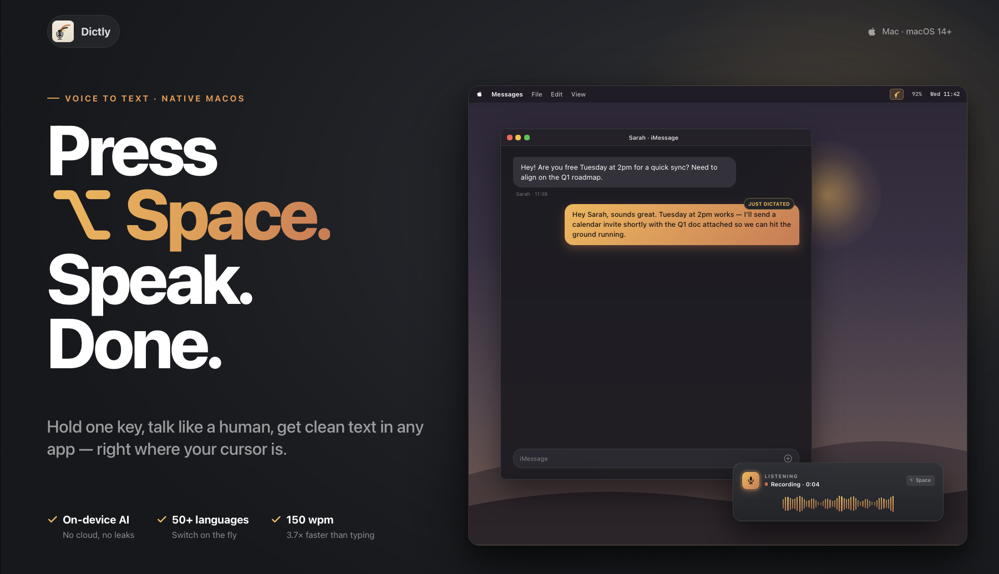
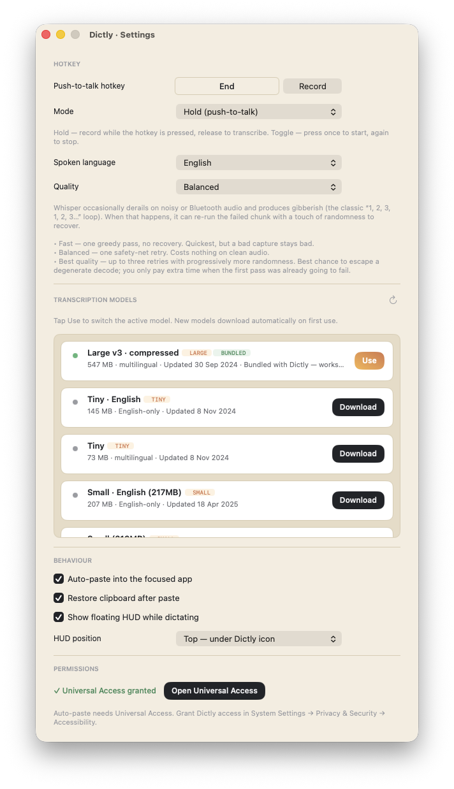

<p align="center">
  
</p>

# Dictly

> Press a hotkey. Speak. Paste anywhere.

A free, open-source macOS menu-bar dictation app. Hold a global hotkey, speak,
release — your speech is transcribed locally by Whisper and placed on the
clipboard (or auto-pasted into the focused app, depending on build).

**Free · Apple Silicon only · macOS 15+ · 99 languages · 100% on-device**

No cloud API. No account. No telemetry. Audio never leaves your Mac.

## Highlights

- **Global push-to-talk hotkey** (default `Fn`). Configurable in Settings.
- **OpenAI Whisper via [WhisperKit](https://github.com/argmaxinc/argmax-oss-swift)**,
  running on Apple's CoreML / Neural Engine. Real-time-factor ≈ 0.1–0.3 on M-series.
- **99 languages** supported by Whisper out of the box. Auto-detection or pinned
  language in Settings.
- **Bundled model** (Whisper `base` multilingual, ~139 MB) — ships in-repo so
  the app works offline from first launch. Higher-quality variants (large-v3,
  large-v3-turbo, etc.) are downloadable from HuggingFace inside the app, or
  fetchable up front via `scripts/fetch_bundled_model.py <variant>`.
- **Pure AppKit**, no SwiftUI dependencies.
- **Auto-paste into the focused app** via simulated ⌘V (needs the standard
  macOS Accessibility permission, granted once on first launch).

## Project layout

```
Dictly/
├── Dictly.xcodeproj/
├── Dictly/                        main app target sources
│   ├── App/                     AppDelegate, DictationCoordinator
│   ├── MenuBar/                 NSStatusItem + menu
│   ├── Hotkey/                  KeyCombo, HotkeyManager (Carbon RegisterEventHotKey)
│   ├── Audio/                   AudioRecorder (AVAudioEngine → 16 kHz mono Float32)
│   ├── Transcription/           Transcriber protocol, WhisperKit, ModelCatalog
│   ├── TextInsertion/           TextInserter (clipboard + simulated ⌘V)
│   ├── PostProcessing/          Hook for post-transcription cleanup
│   ├── Permissions/             Mic + Accessibility checks
│   ├── Settings/                UserDefaults wrapper, settings window
│   ├── HUD/                     Floating "pill" recording HUD
│   ├── Onboarding/              First-run window (permissions + model download)
│   ├── Design/                  DesignTokens, BrandButton, RingedIcon
│   ├── Dictly.entitlements           Direct distribution
│   └── PrivacyInfo.xcprivacy
└── BundledModels/               `base` model (~139 MB) ships in-repo;
                                   larger variants fetched on demand
scripts/
├── fetch_bundled_model.py       Downloads the bundled Whisper model
├── sync_icons.sh                Regenerates app/menu-bar icons from sources
└── sync_menubar_icons.swift
```

## Building from source

### Prerequisites

- macOS 15 (Sequoia) or newer
- Apple Silicon Mac
- Xcode 16+
- Python 3 (only needed if you want to bundle a different Whisper variant
  than the `base` model that ships in-repo)

### Steps

```bash
# 1. Open in Xcode
open Dictly/Dictly.xcodeproj

# 2. Set your own signing team:
#    • Project → target Dictly → Signing & Capabilities
#    • Team: pick your Apple Developer team
#    • Bundle Identifier: change `com.mydear.voicetotext` to something
#      registered to your team (e.g. `com.yourname.dictly`)

# 3. Build & run. The bundled `base` model is already in
#    Dictly/BundledModels/ — the app boots offline-ready.

# (optional) Bundle a heavier model alongside `base`. For example:
python3 scripts/fetch_bundled_model.py large-v3-v20240930_547MB
# After rebuilding, the app picks the highest-quality bundled model as
# its default (see `ModelInfo.defaultModelID`); switching is live in
# Settings → Transcription models.
```

> **Note:** This repository ships the **Direct distribution** build only
> (full functionality, auto-pastes via simulated ⌘V, needs Accessibility).
> The Mac App Store variant (sandboxed, clipboard-only) is maintained
> privately by the original author.

Or from the command line:

```bash
DEVELOPER_DIR=/Applications/Xcode.app/Contents/Developer \
  xcodebuild -project Dictly/Dictly.xcodeproj \
             -scheme Dictly -configuration Release build

open "$(find ~/Library/Developer/Xcode/DerivedData -name Dictly.app -type d | head -1)"
```

## How it works (one-paragraph version)

`DictationCoordinator` owns the long-lived components. On hotkey press,
`AudioRecorder` boots a fresh `AVAudioEngine` and starts streaming 16 kHz mono
Float32 PCM into a buffer. On release, the buffer is handed to
`WhisperKitTranscriber`, which calls Whisper on the bundled CoreML model. The
resulting text passes through a `TextPostProcessor` and is then pasted into the
focused app via `CGEvent` simulating ⌘V (with a clipboard-only fallback if
Accessibility is not yet granted). A floating HUD shows recording/transcribing/
done states throughout.

## Configuration

Open Settings from the menu-bar icon → ⚙️ Settings… Everything is configurable
without restart; changes apply live.

<p align="center">
  
</p>

### Hotkey

- **Push-to-talk hotkey** — the key you hold to record. Click **Record** and
  press your desired combo. Supports both single modifiers (`Fn`, right ⌥,
  right ⌘, …) registered through `NSEvent.addGlobalMonitor`, and regular
  key combos (`⌃⌥D`, `⌘⇧Space`, …) registered through Carbon's
  `RegisterEventHotKey`. Default is `Fn`. Click **End** to clear a binding.
- **Mode** — *Hold* (push-to-talk: record while pressed, release to transcribe)
  or *Toggle* (press once to start, press again to stop). Hold-mode is
  conversational, toggle-mode is better for long-form dictation where you
  don't want to keep a finger down.

### Speech

- **Spoken language** — pick a single language or set to **Auto-detect**. A
  pinned language is usually 5-15% faster and noticeably more accurate on
  short utterances, because Whisper skips the language-detection pass and
  doesn't second-guess homophones across languages. Use *Auto* only if you
  actually code-switch.
- **Quality** — trade-off between speed and resilience against degenerate
  output (the classic *"1, 2, 3, 1, 2, 3…"* loop Whisper produces on noisy /
  Bluetooth-warmup audio):
  - **Fast** — single greedy pass at temperature 0. Quickest, but a bad
    capture stays bad. Good for built-in mic in a quiet room.
  - **Balanced** *(default)* — one safety-net retry if the first pass looks
    degenerate. Costs ~zero on clean audio (the retry is only paid when the
    first pass had high compression ratio / low avg-logprob), and rescues
    most loop cases. The right pick for most users.
  - **Best quality** — up to three retries with progressively more randomness.
    Pays full transcribe cost on each retry, so noticeably slower on bad
    audio. Best for noisy environments, accented speech, multi-speaker
    captures.

  Maps directly to Whisper's `temperatureFallbackCount` (0 / 1 / 3).

### Transcription models

The list shows all variants available from
[`argmaxinc/whisperkit-coreml`](https://huggingface.co/argmaxinc/whisperkit-coreml)
plus any models bundled with the .app. The currently active model has a
**BUNDLED** / **Use** badge.

- Tap **Use** to switch the active model. The switch is instant if the model
  is already cached; otherwise it downloads first (progress shown inline).
- Models are cached under `~/Documents/huggingface/models/argmaxinc/whisperkit-coreml/`
  and reused across launches.
- Higher tiers (large) are more accurate but slower per second of audio and
  use more RAM. **base** runs at real-time-factor ≈ 0.05–0.1 on M-series and
  handles 99 languages just fine for chat / messages. **large-v3** is the
  go-to for transcribing meeting recordings or anything where word-level
  accuracy matters.
- English-only variants (suffix `.en`) are faster and slightly more accurate
  on English, but obviously can't transcribe anything else.
- Tap the **refresh** icon in the section header to re-fetch the catalog
  from HuggingFace.

### Behaviour

- **Auto-paste into the focused app** — after transcription, simulate ⌘V
  into whatever app currently has focus. Off → text stays on the clipboard
  and you press ⌘V manually. Requires the Accessibility permission below.
- **Restore clipboard after paste** — when auto-paste is on, Dictly briefly
  hijacks the system clipboard. With this on, it snapshots the previous
  clipboard contents and restores them 400 ms after the paste, so you don't
  lose whatever you had copied. Off → the transcribed text remains the new
  clipboard contents.
- **Show floating HUD while dictating** — the pill-shaped indicator with the
  live waveform that appears while recording / transcribing. Off → fully
  silent operation; the only feedback is the menu-bar icon state.
- **HUD position** — *Bottom of screen* (centred ~40 pt above the Dock,
  default) or *Top — under Dictly icon* (anchored under the menu-bar icon,
  useful if you dictate into apps that have their own bottom UI like Slack
  or Notes).

### Permissions

- **Microphone** — requested on first launch via the standard macOS prompt.
  Required.
- **Universal Access (Accessibility)** — required only for auto-paste
  (simulating ⌘V into other apps). Without it, Dictly still works in
  clipboard-only mode: it copies the text and you press ⌘V yourself. The
  **Open Universal Access** button deeplinks straight to the right pane in
  System Settings.

All preferences live in `UserDefaults`; nothing leaves your Mac.

## Logging

All logs use `os.Logger` with subsystem `com.mydear.voicetotext`:

```bash
log stream --predicate 'subsystem == "com.mydear.voicetotext"' --info
```

A pipeline timing line lands at `.notice` level after each dictation:

```
⏱️ pipeline: total=1.08s (transcribe=1.05s · post=0.00s · insert=0.03s) for 3.07s audio
```

## License

See [LICENSE](LICENSE).

## Contributing

Issues and PRs welcome. Please open an issue before large changes so we can
discuss the approach.
